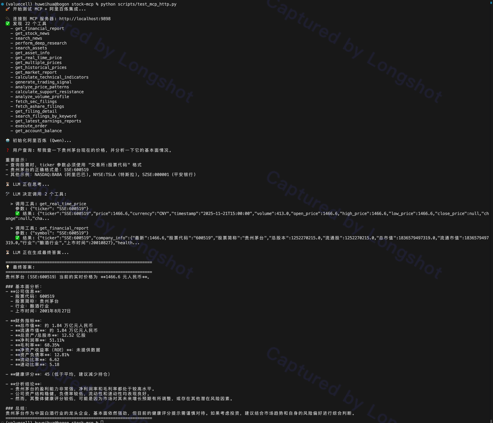
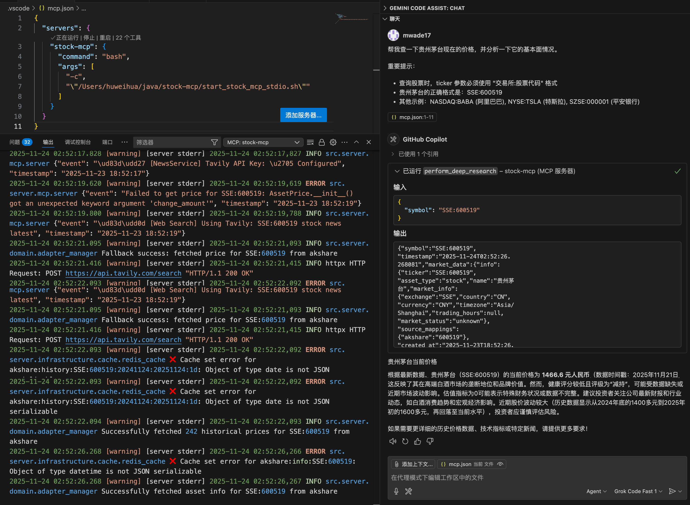

# Stock Tool MCP Server

<div align="center">

**[English](#english-documentation) | 中文文档**

一个强大且全面的模型上下文协议 (MCP) 服务器，专注于金融市场数据、技术分析和基本面研究。

</div>

---

## 🇨🇳 中文文档

### 📖 项目简介

本项目旨在为 AI Agent（如 Claude, Cursor, 通义千问等）赋予专业级的股市分析能力，打通大语言模型与实时金融数据之间的桥梁。

通过 **MCP (Model Context Protocol)** 协议，AI 可以直接调用本服务器提供的金融工具，实现：
- 📊 实时行情查询
- 📈 技术指标计算
- 💰 基本面分析
- 📰 新闻资讯获取
- 🔍 深度研究报告

### 🚀 核心功能

#### 1. 多源市场数据融合

无需纠结使用哪个 API。本服务器内置智能 **Adapter Manager（适配器管理器）**，可自动路由请求并在多个数据源之间进行故障转移：

- **美股**: Yahoo Finance, Finnhub
- **A股**: Akshare, Tushare, Baostock
- **加密货币**: CCXT (Binance, OKX 等)
- **外汇与指数**: Yahoo Finance

#### 2. 专业技术分析

内置量化分析引擎，提供的不仅仅是原始数字：

- **技术指标**: SMA/EMA, RSI, MACD, 布林带 (Bollinger Bands), KDJ, ATR 等
- **形态识别**: 自动检测 K 线形态（如十字星 Doji, 锤头线 Hammer, 吞没形态 Engulfing）
- **支撑与压力**: 动态计算关键价格位
- **筹码分布 (Volume Profile)**: 分析成交量分布以识别价值区域

#### 3. 深度基本面研究

自动化的金融分析师能力：

- **财务报表**: 资产负债表、利润表、现金流量表
- **健康度打分**: 基于盈利能力、偿债能力、成长性和估值的 0-100 分独家健康度评分
- **关键比率**: PE, PB, ROE, ROA, 负债权益比等

#### 4. 智能聚合工具

专为 LLM 上下文窗口优化：

- `perform_deep_research`: 一键获取指定标的的 价格 + 历史走势 + 基本面 + 近期新闻
- `get_market_report`: 获取当前市场状态的综合快照

### 🛠️ 安装指南

#### 前置要求

- Python 3.10+
- Redis (可选，用于缓存)

#### 安装步骤

1. **克隆仓库**
   ```bash
   git clone https://github.com/yourusername/stock-tool-mcp.git
   cd stock-tool-mcp
   ```

2. **创建并激活 Conda 环境**
   ```bash
   # 创建 Python 3.11.14 环境
   conda create -n stock-mcp python=3.11.14
   
   # 激活环境
   conda activate stock-mcp
   ```

3. **安装依赖**
   ```bash
   pip install -r requirements.txt
   ```

4. **配置环境变量**
   
   复制示例环境变量文件:
   ```bash
   cp .env.example .env
   ```
   
   编辑 `.env` 添加你的 API 密钥（可选，但推荐以获得更高限额）:
   - `TUSHARE_TOKEN` - 用于 A 股数据（[获取 Token](https://tushare.pro/register)）
   - `FINNHUB_API_KEY` - 用于美股机构数据（[获取 API Key](https://finnhub.io/)）
   - `DASHSCOPE_API_KEY` - 用于阿里百炼 AI（可选，用于测试）

### 🏃‍♂️ 使用方法

#### 方式一：作为 HTTP 服务器运行（推荐用于测试和开发）

使用 uvicorn 启动 MCP 服务器（Streamable HTTP 模式）：

```bash
# 设置环境变量指定传输方式为 streamable-http
export MCP_TRANSPORT=streamable-http

# 标准启动（监听 9898 端口）
python -m uvicorn src.server.app:app --host 0.0.0.0 --port 9898

# 开发模式（支持热重载）
MCP_TRANSPORT=streamable-http python -m uvicorn src.server.app:app --reload --port 9898
```

启动成功后，你会看到：
```
✅ MCP server ready!
```

**使用示例（Streamable HTTP）**：



#### 方式二：使用 stdio 模式（推荐用于 AI Agent 集成）

stdio 模式通过标准输入输出与 AI Agent 通信，适合 Claude Desktop、Cursor 等本地集成。

**快速启动**：
```bash
# 使用启动脚本（已配置好 conda 环境）
bash start_stock_mcp_stdio.sh
```

**手动启动**：
```bash
# 激活 conda 环境
conda activate stock-mcp

# 启动 stdio 模式（默认传输方式）
python -c "import src.server.mcp.server as m; m.create_mcp_server().run(transport='stdio')"
```

**集成到 Claude Desktop** (`~/Library/Application Support/Claude/claude_desktop_config.json`):
```json
{
  "mcpServers": {
    "stock-tools": {
      "command": "bash",
      "args": ["start_stock_mcp_stdio.sh"],
      "cwd": "/path/to/stock-tool-mcp"
    }
  }
}
```

**集成到 Cursor** (`.cursor/mcp_config.json`):
```json
{
  "mcpServers": {
    "stock-tools": {
      "command": "bash",
      "args": ["start_stock_mcp_stdio.sh"],
      "cwd": "/path/to/stock-tool-mcp"
    }
  }
}
```

**使用示例（stdio 模式）**：



#### 方式三：通过 HTTP API 调用

服务器启动后，可以通过 HTTP 接口调用（Streamable HTTP 协议）：

```bash
# 列出所有可用工具
curl -X POST http://localhost:9898 \
  -H "Content-Type: application/json" \
  -d '{
    "jsonrpc": "2.0",
    "method": "tools/list",
    "params": {},
    "id": "1"
  }'

# 调用工具示例：查询贵州茅台价格
curl -X POST "http://localhost:9898/?_tool=get_real_time_price" \
  -H "Content-Type: application/json" \
  -d '{
    "jsonrpc": "2.0",
    "method": "tools/call",
    "params": {
      "name": "get_real_time_price",
      "arguments": {
        "ticker": "SSE:600519"
      }
    },
    "id": "2"
  }'
```

### 🧰 可用工具一览

| 工具名称                         | 描述                                   | 示例参数                                                                         |
| -------------------------------- | -------------------------------------- | -------------------------------------------------------------------------------- |
| `search_assets`                  | 通过名称或代码搜索股票、加密货币或 ETF | `{"query": "茅台"}`                                                              |
| `get_asset_info`                 | 获取资产的详细信息（公司简介、行业等） | `{"ticker": "SSE:600519"}`                                                       |
| `get_real_time_price`            | 获取任何资产的当前实时价格             | `{"ticker": "SSE:600519"}`                                                       |
| `get_historical_prices`          | 获取指定日期范围的 OHLCV 数据          | `{"ticker": "SSE:600519", "start_date": "2024-01-01", "end_date": "2024-12-31"}` |
| `calculate_technical_indicators` | 计算技术指标 (RSI, MACD 等)            | `{"ticker": "SSE:600519", "indicators": ["rsi", "macd"]}`                        |
| `generate_trading_signal`        | 基于技术指标生成交易信号               | `{"ticker": "SSE:600519"}`                                                       |
| `get_financials`                 | 检索详细的财务报表和比率               | `{"ticker": "SSE:600519"}`                                                       |
| `perform_deep_research`          | **(Agent 首选)** 一次调用聚合所有数据  | `{"ticker": "SSE:600519"}`                                                       |
| `get_latest_news`                | 获取指定标的的相关市场新闻             | `{"ticker": "SSE:600519"}`                                                       |

> **💡 重要提示**: 
> - A股股票代码格式：`SSE:600519`（上交所）、`SZSE:000001`（深交所）
> - 美股股票代码格式：`NASDAQ:AAPL`、`NYSE:TSLA`
> - 加密货币格式：`CRYPTO:BTC`、`CRYPTO:ETH`

### 📸 实际使用示例

本项目支持两种传输协议，分别适用于不同场景：

#### 1. Streamable HTTP 模式
适合通过 HTTP 接口调用，方便测试和集成到 Web 应用：


#### 2. stdio 模式
适合直接集成到 AI Agent（如 Claude Desktop、Cursor），通过标准输入输出通信：


> **💡 两种模式的区别**：
> - **Streamable HTTP**: 需要启动 Web 服务器，支持远程调用，适合生产环境
> - **stdio**: 直接进程通信，无需网络端口，适合本地 AI Agent 集成，延迟更低

### 🧪 测试脚本

项目提供了完整的测试脚本，帮助你快速验证功能：

#### 1. HTTP 接口测试

使用 `scripts/test_mcp_http.py` 测试 MCP 服务器的 HTTP 接口：

```bash
# 1. 启动 MCP 服务器（在一个终端）
python -m uvicorn src.server.app:app --host 0.0.0.0 --port 9898

# 2. 在另一个终端运行测试脚本
python scripts/test_mcp_http.py
```

该脚本会：
- ✅ 连接到 MCP 服务器（http://localhost:9898）
- ✅ 列出所有可用工具
- ✅ 使用阿里百炼（通义千问）调用工具
- ✅ 查询贵州茅台的价格和基本面

#### 2. OpenAPI 文档生成

使用 `scripts/mcp2openapi.py` 生成 OpenAPI 规范文档：

```bash
python scripts/mcp2openapi.py
```

生成的 OpenAPI 文档可以导入到 Apifox、Postman 等工具中进行测试。

### 🗺️ 路线图与未来计划

虽然当前的数据检索和分析能力已相当健壮，但以下功能计划在未来版本中支持：

- [ ] **实盘交易执行**: 目前 `execute_order` 工具处于 **模拟模式 (Simulation Mode)**。我们计划通过 CCXT（加密货币）和券商 API（股票）集成真实的交易下单能力
- [ ] **高级缓存策略**: 实现更细粒度的 TTL (Time-To-Live) 设置，区分实时价格数据（短 TTL）和财务报表（长 TTL），以平衡性能与 API 配额消耗
- [ ] **用户账户管理**: 安全地管理用户特定的交易所 API 密钥，实现个性化交易
- [ ] **更多数据适配器**: 扩展支持更多专业数据源（如情绪分析提供商、另类数据等）
- [ ] **WebSocket 实时推送**: 支持实时行情推送，减少轮询开销
- [ ] **回测引擎**: 内置策略回测功能，验证交易策略的有效性

### 🏗️ 项目架构

本项目采用 **领域驱动设计 (DDD)** 架构，清晰分离关注点：

```
src/server/
├── app.py                 # FastMCP 应用入口
├── config/                # 配置管理
├── core/                  # 核心业务逻辑
│   └── dependencies.py    # 依赖注入容器
├── domain/                # 领域层
│   ├── adapters/          # 数据适配器（Yahoo, Akshare, Tushare 等）
│   ├── models/            # 领域模型
│   └── services/          # 领域服务
├── infrastructure/        # 基础设施层
│   ├── cache/             # 缓存（Redis）
│   └── external/          # 外部 API 客户端
├── mcp/                   # MCP 协议层
│   └── tools/             # MCP 工具定义
└── utils/                 # 工具类
```

**核心设计原则**:
- 📦 **适配器模式**: 统一多数据源接口，自动故障转移
- 🔌 **依赖注入**: 使用 `dependency-injector` 管理服务生命周期
- ⚡ **异步优先**: 所有外部调用均为异步，提升并发性能
- 🎯 **单一职责**: 每个服务专注于特定领域功能

### 📄 许可证

MIT License

---

<a name="english-documentation"></a>

## 🇬🇧 English Documentation

### 📖 Introduction

A powerful, comprehensive Model Context Protocol (MCP) server for financial market data, technical analysis, and fundamental research.

Designed to empower AI agents (like Claude, Cursor, etc.) with professional-grade stock market capabilities, bridging the gap between LLMs and real-time financial data.

### 🚀 Features

#### 1. Multi-Source Market Data

Stop worrying about which API to use. The server features a smart **Adapter Manager** that automatically routes requests and handles failover across multiple providers:

- **US Stocks**: Yahoo Finance, Finnhub
- **China A-Shares**: Akshare, Tushare, Baostock
- **Crypto**: CCXT (Binance, OKX, etc.)
- **Forex & Indices**: Yahoo Finance

#### 2. Professional Technical Analysis

Built-in quantitative analysis engine providing more than just raw numbers:

- **Indicators**: SMA/EMA, RSI, MACD, Bollinger Bands, KDJ, ATR
- **Pattern Recognition**: Automatically detects candlestick patterns (Doji, Hammer, Engulfing)
- **Support & Resistance**: Dynamic calculation of key price levels
- **Volume Profile**: Analysis of volume distribution to identify value areas

#### 3. Deep Fundamental Research

Automated financial analyst capabilities:

- **Financial Statements**: Balance Sheet, Income Statement, Cash Flow
- **Health Scoring**: 0-100 proprietary health score based on Profitability, Solvency, Growth, and Valuation
- **Key Ratios**: PE, PB, ROE, ROA, Debt-to-Equity, and more

#### 4. Smart Aggregation Tools

Optimized for LLM context windows:

- `perform_deep_research`: One-shot tool to fetch price, history, fundamentals, and recent news for a symbol
- `get_market_report`: A comprehensive snapshot of the current market status

### 🛠️ Installation

#### Prerequisites

- Python 3.10+
- Redis (optional, for caching)

#### Setup

1. **Clone the repository**
   ```bash
   git clone https://github.com/yourusername/stock-tool-mcp.git
   cd stock-tool-mcp
   ```

2. **Create and activate Conda environment**
   ```bash
   # Create Python 3.11.14 environment
   conda create -n stock-mcp python=3.11.14
   
   # Activate environment
   conda activate stock-mcp
   ```

3. **Install dependencies**
   ```bash
   pip install -r requirements.txt
   ```

4. **Configuration**
   
   Copy the example environment file:
   ```bash
   cp .env.example .env
   ```
   
   Edit `.env` to add your API keys (optional but recommended for higher limits):
   - `TUSHARE_TOKEN` - For China A-shares data ([Get Token](https://tushare.pro/register))
   - `FINNHUB_API_KEY` - For US institutional data ([Get API Key](https://finnhub.io/))
   - `DASHSCOPE_API_KEY` - For Alibaba Cloud AI (optional, for testing)

### 🏃‍♂️ Usage

#### Method 1: Run as HTTP Server (Recommended for Testing & Development)

Start the MCP server using uvicorn (Streamable HTTP mode):

```bash
# Set environment variable to specify transport mode
export MCP_TRANSPORT=streamable-http

# Standard run (listening on port 9898)
python -m uvicorn src.server.app:app --host 0.0.0.0 --port 9898

# Development mode (with hot reload)
MCP_TRANSPORT=streamable-http python -m uvicorn src.server.app:app --reload --port 9898
```

After successful startup, you'll see:
```
✅ MCP server ready!
```

**Example (Streamable HTTP mode)**:


#### Method 2: Use stdio Mode (Recommended for AI Agent Integration)

stdio mode communicates with AI agents via standard input/output, suitable for local integration with Claude Desktop, Cursor, etc.

**Quick Start**:
```bash
# Use the startup script (conda environment pre-configured)
bash start_stock_mcp_stdio.sh
```

**Manual Start**:
```bash
# Activate conda environment
conda activate stock-mcp

# Start stdio mode (default transport)
python -c "import src.server.mcp.server as m; m.create_mcp_server().run(transport='stdio')"
```

**Integrate with Claude Desktop** (`~/Library/Application Support/Claude/claude_desktop_config.json`):
```json
{
  "mcpServers": {
    "stock-tools": {
      "command": "bash",
      "args": ["start_stock_mcp_stdio.sh"],
      "cwd": "/path/to/stock-tool-mcp"
    }
  }
}
```

**Integrate with Cursor** (`.cursor/mcp_config.json`):
```json
{
  "mcpServers": {
    "stock-tools": {
      "command": "bash",
      "args": ["start_stock_mcp_stdio.sh"],
      "cwd": "/path/to/stock-tool-mcp"
    }
  }
}
```

**Example (stdio mode)**:


#### Method 3: HTTP API Calls

After starting the server, you can call it via HTTP interface (Streamable HTTP protocol):

```bash
# List all available tools
curl -X POST http://localhost:9898 \
  -H "Content-Type: application/json" \
  -d '{
    "jsonrpc": "2.0",
    "method": "tools/list",
    "params": {},
    "id": "1"
  }'

# Call tool example: Query Moutai stock price
curl -X POST "http://localhost:9898/?_tool=get_real_time_price" \
  -H "Content-Type: application/json" \
  -d '{
    "jsonrpc": "2.0",
    "method": "tools/call",
    "params": {
      "name": "get_real_time_price",
      "arguments": {
        "ticker": "SSE:600519"
      }
    },
    "id": "2"
  }'
```

### 🧰 Available Tools

| Tool Name                        | Description                                                      | Example Parameters                                                               |
| -------------------------------- | ---------------------------------------------------------------- | -------------------------------------------------------------------------------- |
| `search_assets`                  | Search for stocks, crypto, or ETFs by name or ticker             | `{"query": "Moutai"}`                                                            |
| `get_asset_info`                 | Get detailed asset information (company profile, industry, etc.) | `{"ticker": "SSE:600519"}`                                                       |
| `get_real_time_price`            | Get the current live price for any asset                         | `{"ticker": "SSE:600519"}`                                                       |
| `get_historical_prices`          | Fetch OHLCV data for a specific date range                       | `{"ticker": "SSE:600519", "start_date": "2024-01-01", "end_date": "2024-12-31"}` |
| `calculate_technical_indicators` | Compute technical indicators (RSI, MACD, etc.)                   | `{"ticker": "SSE:600519", "indicators": ["rsi", "macd"]}`                        |
| `generate_trading_signal`        | Generate trading signals based on technical indicators           | `{"ticker": "SSE:600519"}`                                                       |
| `get_financials`                 | Retrieve detailed financial statements and ratios                | `{"ticker": "SSE:600519"}`                                                       |
| `perform_deep_research`          | **(Agent Favorite)** Aggregate all data in one call              | `{"ticker": "SSE:600519"}`                                                       |
| `get_latest_news`                | Fetch relevant market news for a specific symbol                 | `{"ticker": "SSE:600519"}`                                                       |

> **💡 Important Note**: 
> - A-share ticker format: `SSE:600519` (Shanghai), `SZSE:000001` (Shenzhen)
> - US stock ticker format: `NASDAQ:AAPL`, `NYSE:TSLA`
> - Crypto format: `CRYPTO:BTC`, `CRYPTO:ETH`

### 📸 Real-World Examples

This project supports two transport protocols, each suitable for different scenarios:

#### 1. Streamable HTTP Mode
Suitable for HTTP interface calls, convenient for testing and integration into web applications:


#### 2. stdio Mode
Suitable for direct integration into AI Agents (like Claude Desktop, Cursor), communicating via standard input/output:


> **💡 Differences Between the Two Modes**:
> - **Streamable HTTP**: Requires a web server, supports remote calls, suitable for production environments
> - **stdio**: Direct process communication, no network port required, suitable for local AI Agent integration with lower latency

### 🧪 Test Scripts

The project provides comprehensive test scripts to help you quickly verify functionality:

#### 1. HTTP Interface Testing

Use `scripts/test_mcp_http.py` to test the MCP server's HTTP interface:

```bash
# 1. Start the MCP server (in one terminal)
python -m uvicorn src.server.app:app --host 0.0.0.0 --port 9898

# 2. Run the test script in another terminal
python scripts/test_mcp_http.py
```

This script will:
- ✅ Connect to the MCP server (http://localhost:9898)
- ✅ List all available tools
- ✅ Use Alibaba Cloud Qwen to call tools
- ✅ Query Moutai's price and fundamentals

#### 2. OpenAPI Documentation Generation

Use `scripts/mcp2openapi.py` to generate OpenAPI specification:

```bash
python scripts/mcp2openapi.py
```

The generated OpenAPI documentation can be imported into tools like Apifox or Postman for testing.

### 🗺️ Roadmap & Future Plans

While the data retrieval and analysis capabilities are robust, the following features are planned for future releases:

- [ ] **Real Trading Execution**: Currently, the `execute_order` tool runs in **simulation mode**. We plan to integrate real trading capabilities via CCXT (for crypto) and broker APIs (for stocks)
- [ ] **Advanced Caching Strategy**: Implement fine-grained TTL (Time-To-Live) settings to distinguish between real-time price data (short TTL) and financial reports (long TTL) for better performance and API quota management
- [ ] **User Account Management**: Secure handling of user-specific exchange API keys for personalized trading
- [ ] **More Data Adapters**: Expansion to include more specialized data sources (e.g., sentiment analysis providers, alternative data)
- [ ] **WebSocket Real-time Push**: Support real-time market data push to reduce polling overhead
- [ ] **Backtesting Engine**: Built-in strategy backtesting functionality to validate trading strategies

### 🏗️ Project Architecture

This project adopts **Domain-Driven Design (DDD)** architecture with clear separation of concerns:

```
src/server/
├── app.py                 # FastMCP application entry
├── config/                # Configuration management
├── core/                  # Core business logic
│   └── dependencies.py    # Dependency injection container
├── domain/                # Domain layer
│   ├── adapters/          # Data adapters (Yahoo, Akshare, Tushare, etc.)
│   ├── models/            # Domain models
│   └── services/          # Domain services
├── infrastructure/        # Infrastructure layer
│   ├── cache/             # Caching (Redis)
│   └── external/          # External API clients
├── mcp/                   # MCP protocol layer
│   └── tools/             # MCP tool definitions
└── utils/                 # Utilities
```

**Core Design Principles**:
- 📦 **Adapter Pattern**: Unified multi-source interface with automatic failover
- 🔌 **Dependency Injection**: Using `dependency-injector` for service lifecycle management
- ⚡ **Async First**: All external calls are asynchronous for improved concurrency
- 🎯 **Single Responsibility**: Each service focuses on specific domain functionality

### 📄 License

MIT License
